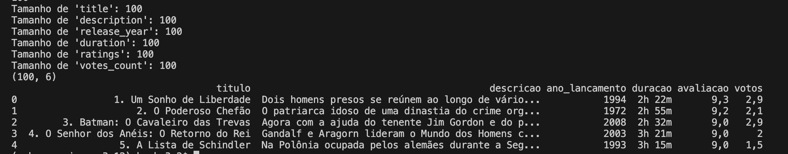
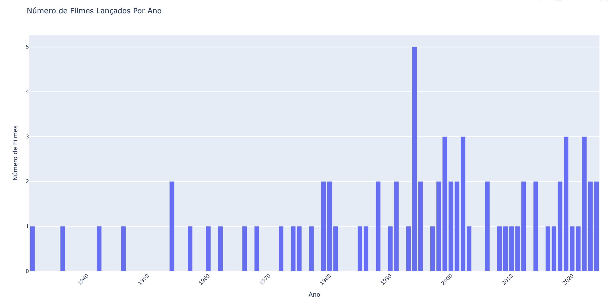
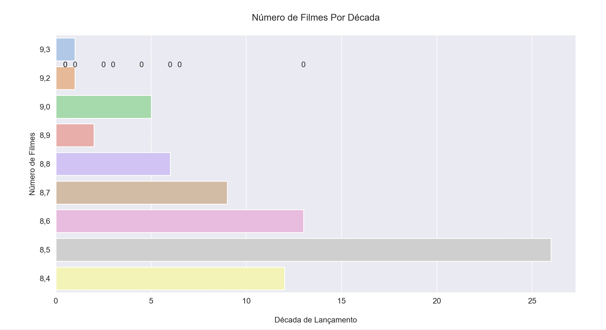
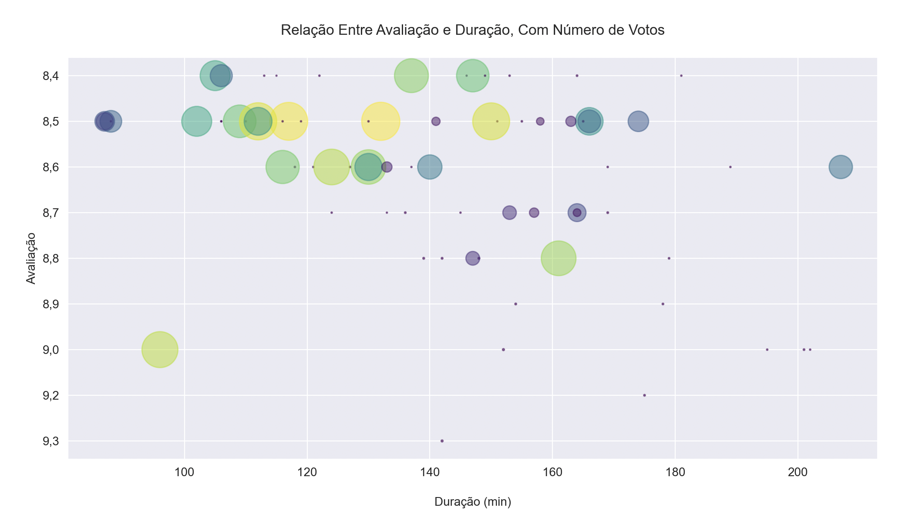
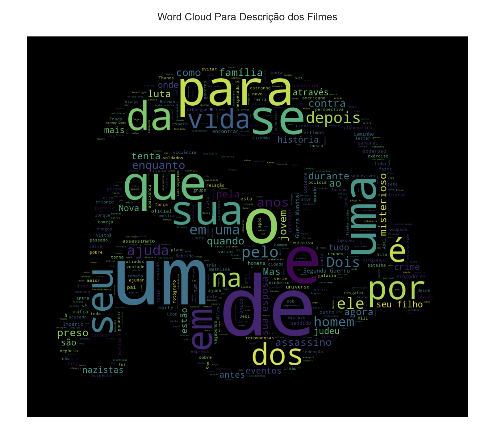
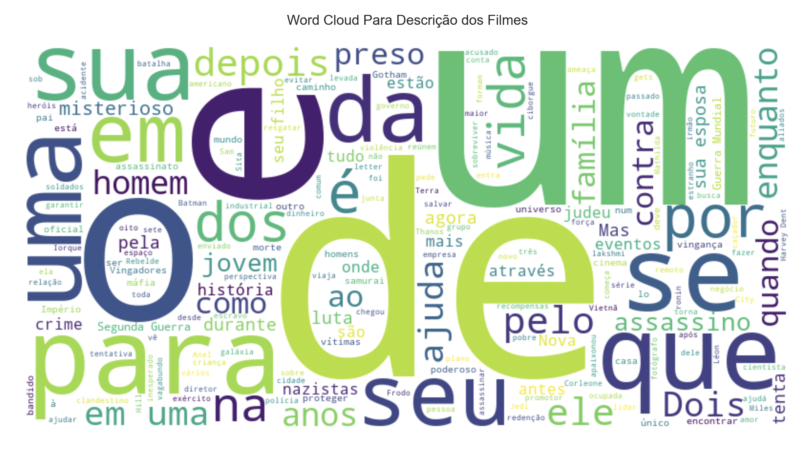

# Testando web scraping

BeautifulSoup e Selenium

O Objetivo do lab web_scraping.py é coletar os dados de melhores filmes e gerar um arquivo dataset.csv e depois fazer a analise e colocar em uma nuvem de palavras

## Web Scraping 

Faça o Clone do repositório Github
`git clone https://github.com/Silmara-Basso/web-scraping.git`
execute `python3 web_scraping.py`

## Analytics

Depois de executar o script de web scraping acima, execute execute `python3 analytics.py`
Como resultado tera as respostas as questões abaixo em forma de graficos e nuvens de palavras abaixo

- 1- Quantos Filmes Foram Lançados a Cada Ano?

- 2- Qual Década Teve o Maior Número de Lançamentos de Filmes?

- 3- Demonstre com Gráfico de Bolhas a Relação Entre Avaliação e Duração, Com Número de Votos.

- 4- Qual a Força da Correlação Entre Duração do Filme e o Número de Votos? 

- 5- Crie Uma Nuvem de Palavras Mostrando as Palavras Mais Frequentes na Descrição dos Filmes.

